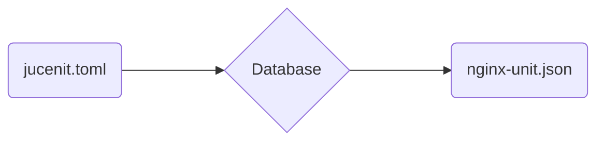
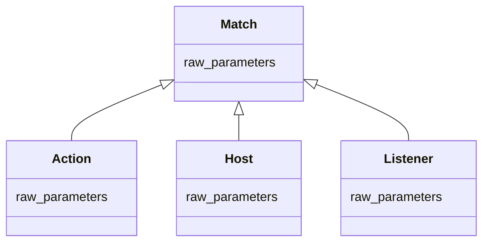
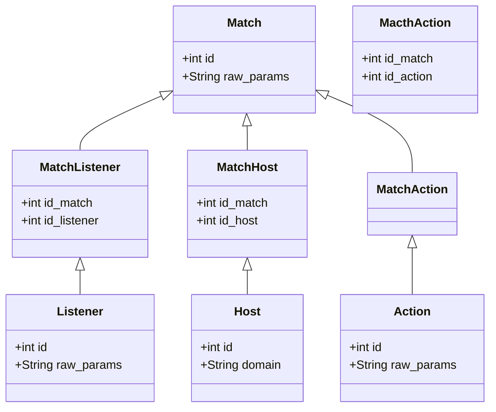

# Jucenit internals

## What it is.

I do not have the time to maintain such a good piece of software
as a mature server like nginx-unit.

Jucenit is only a translation layer from an easy toml syntax
to nginx-unit configuration file.

Plus some utilities to ease ssl renewal and live edit configuration.

## Crate structure

Database crates:

- migration: Database schema definition.
- entity: Autogenerated with ORM.

Convenience crates:

- jucenit: Entrypoint for binary.
- utils: Pipelight utility crate for filesystem and process management.

Core crate:

- jucenit_core: The main crate were the everything is done.
  Core modules:
  - cast: toml to database entities
  - nginx: database entities to json and ssl renewal.

## How it works.

### File type convertion.

The toml configuration is split into small related entities that are pushed to a relational database (sqlite).
The entities are then taken from the database,
and reassembled into the equivalent nginx-unit configuration.

Yes, the database serves the solo purpose of file convertion,
so it is has a pretty simple schema, but it drastically decreases the code comlexity.

The database schema is defined inside the **migration crate** through a practical rust orm
[sea_orm](https://www.sea-ql.org/SeaORM/docs/index/).

_I have been traumatised with ORM so I could have written raw SQL, but SeaORM really
does a pleasant heavy lifting._

Simplified diagram without relation tables.

Complete diagram with relation tables.

Every relations are many to many through a relation table.

### Auto Ssl (tls certificate management)

Relate on a slighty modified version of [acme2](https://docs.rs/acme2/latest/acme2/) crate, which is
[pipelight-acme2](https://github.com/pipelight/acme2).
